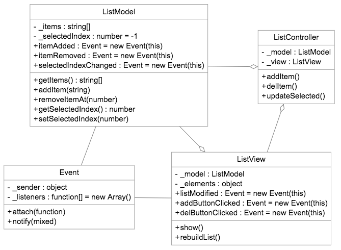

# MVC Patter with Javascript

출처 : https://alexatnet.com/articles/model-view-controller-mvc-javascript


자바스크립트는 세계에서 가장 유연한 언어중에 하나이다. 이것은 넓은 범위의 프로그래밍 스타일과 기술들을 지원하지만 그러한 유연성이 위험을 가져오기도 한다. 만약 디자인 패턴이나 관행, 실행을 잘못된 방식, 모순된 방식으로 한다면 자바스크립트 프로젝트는 엉망이 되기 매우 쉽다.

이 article의 목표는 간단한 JS 컴포넌트를 개발하는 동안 MVC 패턴을 어떻게 적용하는지를 서렴ㅇ하는 것이다. 이 컴포넌트는 입력기능이 있는 HTML ListBox  이다. 유저들은 리스트를 선택해서 삭제 하고, 새로운 항목을 추가할수 있어야 한다. 이 컴포넌트는 MVC 디자인 패턴에 각각 대응되는 3가지 클래스로 이루어져 있다.

이 글은 읽는 것도 좋겠지만 이 예제를 실행해보고 필요에 맞게 이것들을 적용시켜본다면 더욱 좋을 것이다. 당신은 JS 프로그램을 만들고 실행할수 있는 모든 것을 가지고 있을 것이다. 두뇌, 손, 텍스트 에디터, 그리고 웹 브라우저 말이다. 

MVC 패턴은 몇가지 서술을 요구한다. 당신도 아마도 알듯이, 이 패턴은 어플리케이션을 저장하는 Model, 모델을 적절하게 그려줄 View, 모델을 업데이트 하는 Controller 이렇게 3가지 메인 파츠가 기반으로 하고 있다.  위키에서는 MVC 아키텍처의 대표적인 컴포넌트들을 다음과 같이 정의하고 있다.

- 모델 - 애플리케이션이 동작하는데 이어서 정보에 대한 도메인-특정한 표현이다. 도메인 레이어에 대한 또다른 이름이 모델이다. 도메인 로직은 raw data에 의미를 더한다.
- 뷰 - 상호작용에 대한 적절함 폼에서 모델을 렌더링하는 것으로 전형적으로 유저 인터페이스 엘리먼트이다. MVC는 자주 웹 퍼블리케이션에서 보여진다.
- 컨트롤러 - 이벤트, 일반적으로 유저 행동에 대한 반응과 프로세스들이며 모델과 뷰에 변화를 가져온다.

컴포넌트의 데이타는 단지 선택될수 있고 지워질수 있는 특정한 아이템들의 리스트이다.  그래서 컴포넌트의 모델은 아주 간단하다. 배열과 선택된 아이템의 인덱스로 구성되어 있다.

```javascript
/* Model : 모델은 항목들을 저장하고 옵저버에 변화를 알린다. */
function ListModel(items) {
  // private 변수 
  this._items = items;
  this._selectedIndex = -1;
  
  this.itemAdded = new Event(this);
  this.itemRemoved = new Event(this);
  this.selectedIndexChanged = new Event(this);
}

// 메소드
ListModel.prototype = {
  getItems : function() {
    return [].concat(this._items);
  },
  addItem : funtion(itme) {
    this._items.push(item);
  	this.itemAdded.notify({item : item});
  },
  removeItemAt : function(index) {
    // 삭제할 대상 변수 저장
    var item = this._items[index];
    
    // _items에서 삭제
    this._items.splice(index, 1);
    
    // 삭제된 항목을 알림 
    this.itemRemoved.notify({item:item});
    
    // _selectedIndex와 일치할 경우 -1로 설정
    if(index === this._selectedIndex) {
      this.setSelectedIndex(-1);
    }
  },
  getSelectedIndex : function() {
    return this._selectedIndex;
  },
  setSelectedIndex : function(index) {
    // 이전 인덱스 저장
    var previousIndex = this._selectedIndex;
    
    // _selectedIndex에 현재 인덱스 저장
    this._selectedIndex = index;
    
    // 변화된 것을 알려준다.
    this.selectedIndexChanged.notify({previous : previousIndex});
  }
};
```


이벤트는 옵저버패턴을 구현한 간단한 클래스이다.

```javascript
function Event(sender) {
  this._sender = sender;
  this._listener = [];
}
Event.prototype = {
  // 이벤트 저장
  attach : function(listener) {
    this._listeners.push(listener);
  },
  // 변경시 알림
  notify : function(args) {
    var index = 0;
    var len = this._listeners.length;
    for(index; index < len; index += 1) {
      this._listeners[index](this._sender, args);
    }
  }
};
```


View클래스는 상호작용에 대한 컨트롤 정의를 요구한다. task에 대해서 많은 대체 인터페이스가 있다. 하지만 저자는 가장 심플한 것을 좋아한다고 한다. `plus` 버튼과 `minus` 버튼, 이 2가지 버튼과 Listbox 컨트롤 안에 항목들을 넣을 것이다. 하나의 항목을 선택하는 것에 대한 지원은 Listbox 자체의 기능으로서 제공될 것이다. View 클래스는 타이트하게 Controller 클래스로 묶여질 것이다. 이 Controller 클래스는 등록되어 있는 핸들러, 콜백을 통해, 유저 인터페이스에서 일어나는 입력 이벤트를 다룬다.

여기 View와 Controller 클래스가 있다.

```javascript
/* View : 뷰는 모델을 보여주고 UI 이벤트를 제공한다.
 * Controller : 컨트롤러는 유저인터페이스를 다루는 이러한 이벤트가 붙여진다.
 */

function ListView(model, elements) {
  this._model = model;
  this._elements = elements;
  this.listModified = new Event(this);
  this.addButtonClicked = new Event(this);
  this.delButtonClicked = new Event(this);
  
  var _this = this;
  
  this.elements.list.change(function(e) {
    _this.listModified.notify({index : e.targetselectedIndex});
  });
  this._elements.addButton.click(function() {
    _this.addButtonClicked.notify();
  });
  this._elements.delButton.click(funciton() {
    _this.delButtonClicked.notify();
  });
}

ListView.prototype = {
  show : function() {
    this.rebuildList();
  }
  rebuildList : function() {
    var list, items, key;
    list = this._elements.list;
    list.html('');
    
    items = this._model.getItems();
    for(key in items) {
      if(items.hasOwnProperty(key)) {
        list.append($('<option>' + items[key] + '</option>'));
      }
    }
    this._model.setSelectedIndex(-1);
  }
}

/* Controller : 컨트롤러는 유저 액션에 반응하고 모델의 변화를 가져온다. */
function ListController(model, view) {
  this._model = model;
  this._view = view;
  
  var _this = this;
  this._view.listModified.attach(function(sender, args) {
    _this.updateSelected(args.index);
  });
  this._view.addButtonClicked.attach(function() {
    _this.addItem();
  });
  this._view.delButtonClicked.attach(function() {
    _this.delItem();
  });
}

ListController.prototype = {
  addItem : function() {
    var item = window.prompt('Add item:', '');
    if(item) {
      this._model.addItem(itme);
    }
  },
  delItem : function() {
    var index;
    index = this._model.getSelectedIndex();
    if(index !== -1){
      this._model.removeItemAt(this._model.getSelectedIndex());
    }
  },
  updateSelected : function(index) {
    this._model.setSelectedIndex(index);
  }
}
```


그리고 물론, Model, View, Controller 클래스들은 인스턴스화해야 한다. 아래의 예제처럼 클래스들을  설정하고 인스턴스화하면 된다.

```javascript
$(function () {
  var model = new ListModel(['PHP', 'JavaScript']),
      view = new ListView(model, {
        'list' : $('#list'),
        'addButton' : $('#plusBtn'),
        'delButton' : $('#monusBtn')
      }),
      controller = new ListController(model, view);
  view.show();
})
```

```html
<select id="list"></select>
<button id="plusBtn"> + </button>
<button id="minusBtn"> - </button>
```


이해를 돕기 위한 UML 이다.



