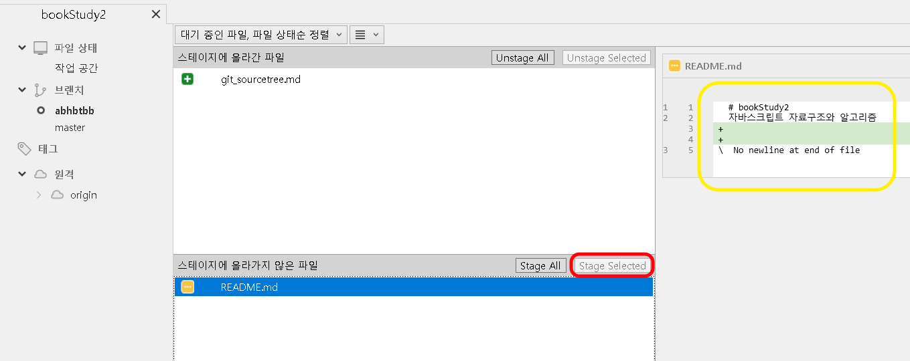
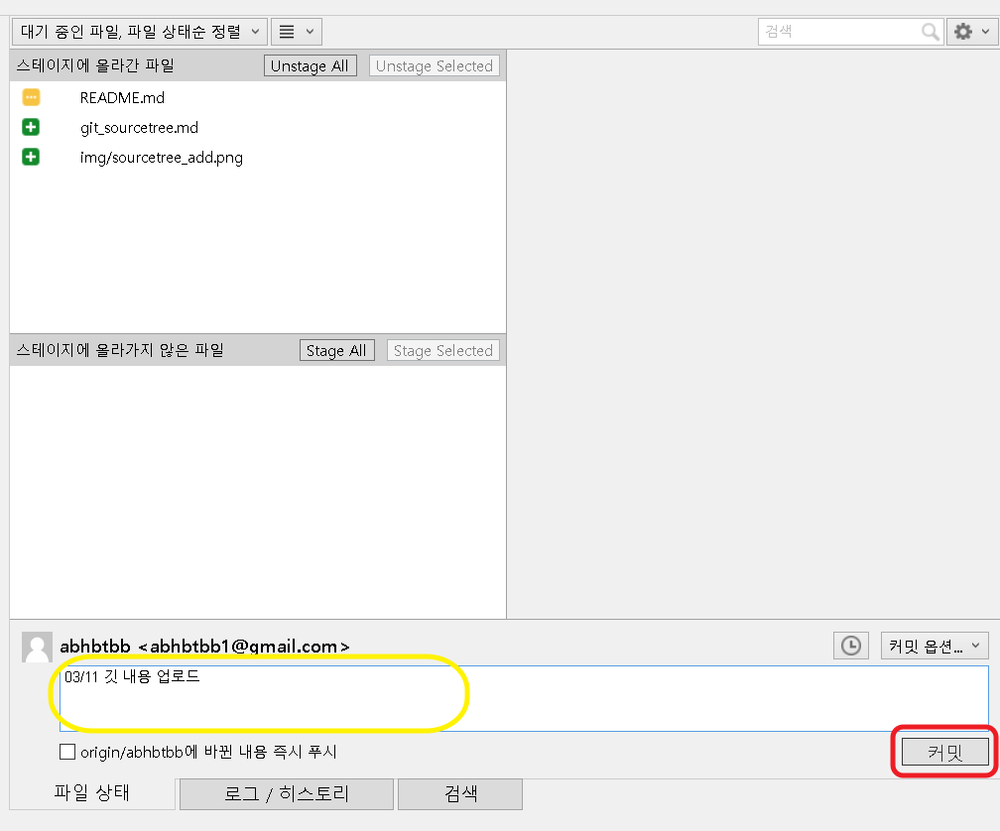
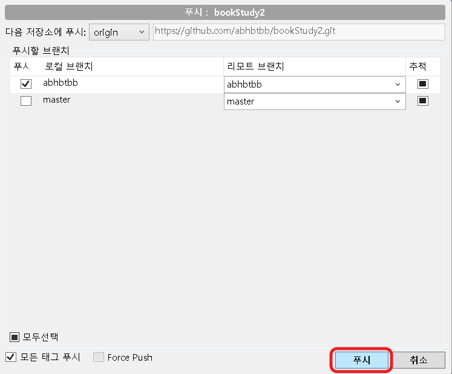
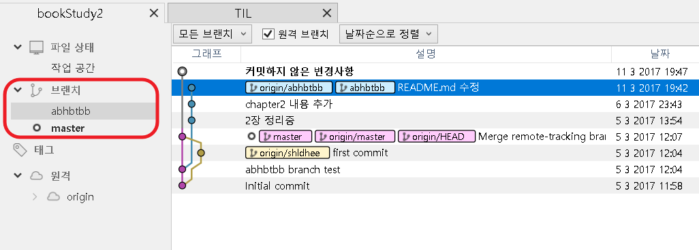

# 버전 관리 시스템 GIT

## 버전관리 시스템

### 버전 관리 시스템이란?

- 버전을 관리하는 시스템이다.
- 버전 : 기능을 개선하거나 버그를 수정 하는 등의 의미있는 변화를 말한다.

### 버전관리란?

- 소스 하나 또는 묶음을 하나의 버전으로 간주하여 관리한다.
- 원하는 때에 예전 버전 내용 전체를 되돌려 볼수 있으며 복잡한 코드일수록 이전 버전과의 비교, 백업, 롤백 등의 작업을 하기 용이하다.

### 언제 사용하는가?

- 개발 협업을 위해 사용한다.
  - 전체 개발 소스를 공유하면서 개발 파트를 나누어서 공유한다.
  - 같은 시스템을 개발하더라도 소스를 서로 공유하면서 개발한다.
- 개별적으로 버전 등 이력을 관리하기 위해 사용한다.
- 버전 관리되는 내역을 오픈 소스로 공유한다.

## 깃

### 깃이란?

- 깃은 빠르고 효율적으로 작은 규모부터 매우 큰 규모의 프로젝트들을 다룰수 있게 설게된 분산형 버전관리 시스템으로 오픈소스 이다. 
- 분산형이란 원본 소스가 있고 그 소스를 복사해서 프로젝트내에서 별개의 저장소를 운영하고 그 안에서 별개의 버전 관리 및 작업이 가능하다는 것이다.  또한 서버의 접속 없이도 개발이 가능한 것을 말한다.

### 깃 설치

- [깃 설치](https://git-scm.com/) 에 가서 우측에 있는 **Downloads fot Windows**를 클릭한다.
- 다운을 받고 설치를 한다.

## 소스트리

### 소스트리란?

- 깃을 사용하기 편하게 도와주는 프로그램이다.
- 깃은 커맨드를 쳐서 동작하기 때문에 그래픽 인터페이스를 제공하는 소스트리를 처음 사용하기에는 좋다.

### 소스트리 설치

- [소스트리 설치](https://www.sourcetreeapp.com/) 에 가서 **Download for Windows** 를 클릭하여 다운로드 및 설치한다.
- 가입하라고 뜰텐데 간단하게 가입을 하고 실행하면 된다.

## 깃허브 

### 깃허브란?

- 깃을 사용하는 프로젝트를 지원하는 유/무료 웹호스팅 서비스이다.
- 깃은 텍스트 방식인데 비해서 깃허브는 웹사이트에서 시각적으로 보여준다.
- 다른 사람들과 협업을 할수 있으며 각자의 아이디를 통해서 프로젝트를 같이 진행할수 있다.
- 다른 사람의 저장소에 접근해서 공개된 코드등을 볼 수 있으며 복사해서 가져올수 있다.
- 프로젝트를 진행할 때 pull request, issue 등을 기재하여 원활한 프로젝트 진행을 돕는다.

### 깃허브 사용하기

- [깃허브 가입](https://github.com/) 에 가서 가입한다.
- 로그인을 하고 사용하면 된다.

## 깃 명령어 및 사용방법

### git add [파일/폴더]

- 변경사항을 추가하는 명령어이다.
- `git add .` 를 하면 전체 범위로 `git add`를 실행한다.
- `git reset`을 통해서 취소 할 수 있다.

##### 소스트리

아래와 같이 해당 파일을 선택해서 Stage Selected 하면 된다. 빨간색 박스 참조.

### git commit

- 추가된 변경사항을 로컬에 저장하는 명령어이며 간단한 메세지 작성이 가능하다.
- 한번 커밋한 것은 rebase를 통해서 수정이 가능하다.
- 이후 `git push`를 통해서 원격 저장소로 올릴수 있다.

##### 소스트리

올려야할 파일을 클릭해서 추가하고 그 이후 커밋 메세지 작성(노란 박스) 후 커밋 (빨간 박스)

### git push

- 원격 저장소로 새로 커밋한 사항들을 업로드 하는 명령어이다.
- 만약 업로드 하려는 원격 저장소에 변경사항이 있을 경우에는 `git pull`을 받고 가능하다.
- 만약 협업시에 동일한 부분에 동시에 수정이 되었을 때는 confilct가 발생하고 이것을 해결한 이후에 git push가 가능하다.

##### 소스트리

커밋을 하면 빨간 박스에 숫자가 생기는데 이것을 클릭한다.

아래와 같은 창이 뜨는데 푸쉬 버튼을 누르면 진행된다.

### git pull

- 원격저장소에서 달라진 부분들을 다운로드 하는 명령어이다.
- 자신이 올리려고 하는 저장소에 변경사항이 존재할 경우 먼저 `git pull` 을 하고 나서 `git push`가 가능하다.

##### 소스트리

원격 저장소에 변경사항이 생기면 풀 버튼에 숫자가 생기는데 그때 클릭하면 진행된다. 푸쉬 오른편에 있는 **풀** 이라는 버튼이다.

### git branch

- 브랜치들을 볼수 있는 명령어이다.

-  브랜치란 나뭇가지, 분기를 줘서 작업을 따로 할 수 있다.
- 무언가 수정해야 하거나, 기능을 추가하거나, 버그등을 수정해야 할 때 손쉽게 동일한 소스를 분기해서 작업을 할수 있으며 나중에 합칠 때에도 쉽게 합칠수 있기 때문에 브랜치를 사용한다.
- ​

### git checkout 브랜치 이름

- 해당 브랜치로 이동한다.

##### 소스트리

아래의 빨간 사각형 안에 있는 것이 브랜치들이다. 클릭을 통해서 이동이 가능하다.

### git branch 이름

- 브랜치를 생성한다.

##### 소스트리

브랜치 추가는 아래 화면의 브랜치 아이콘을 클릭해서 생성할수 있다.

### git log

- 깃 커밋 로그들을 볼수 있는 명령어이다.

##### 소스트리

기본 화면에서 확인이 가능하다.

### git diff

- 변경사항들을 볼수 있는 명령어이다.

##### 소스트리

해당 파일을 클릭하면 노란색 박스 안에 변경 사항을 확인할 수 있다.

